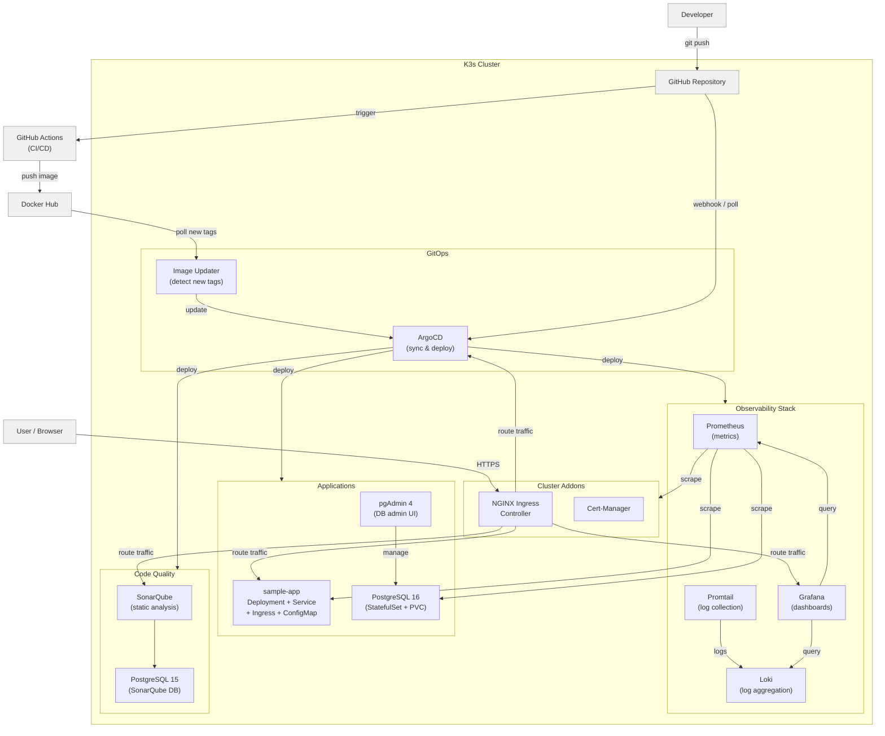
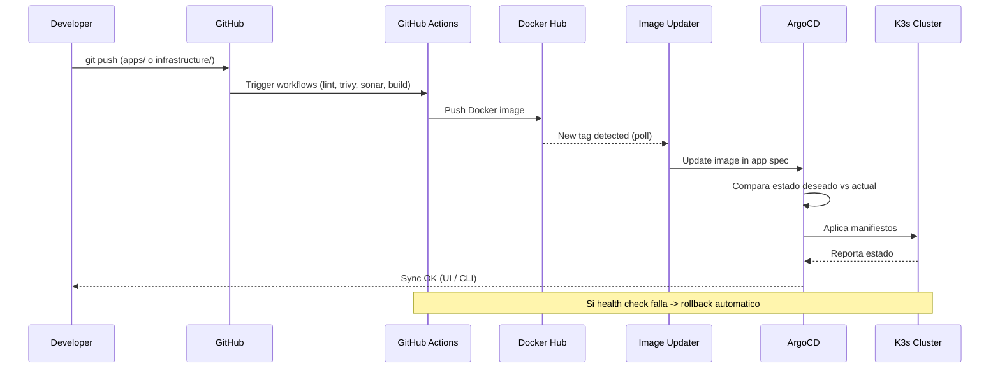
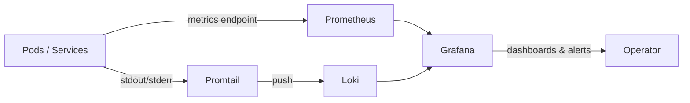
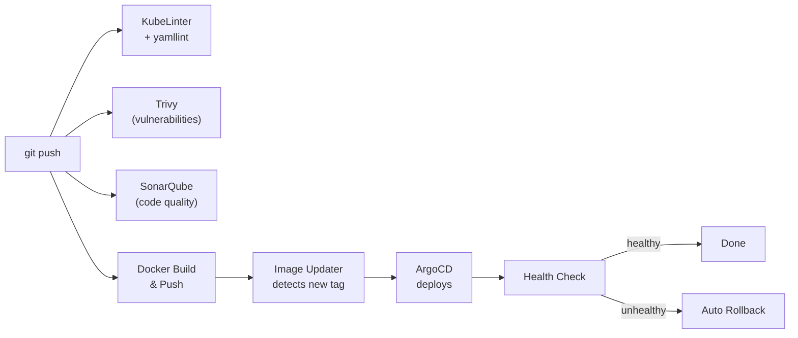

# Arquitectura - K3s Dev Platform Lab

## Diagrama general

## Flujo GitOps

## Flujo de observabilidad

## Flujo CI/CD

## Componentes

### Capa de cluster (cluster/)
- **K3s**: Distribucion ligera de Kubernetes (v1.34+, incluye Metrics Server)
- **NGINX Ingress**: Controlador de trafico entrante (NodePort 31080/31443)
- **Cert-Manager**: Gestion automatica de certificados TLS

> **Nota:** K3s trae Traefik por defecto ocupando puertos 80/443. NGINX Ingress usa NodePort para evitar el conflicto. Para usar puertos estandar, instalar K3s con `--disable traefik`.

### Capa de infraestructura (infrastructure/)
- **ArgoCD**: Motor de GitOps para despliegue continuo
- **ArgoCD Image Updater**: Detecta nuevas imagenes en Docker Hub y actualiza deployments
- **Prometheus**: Recoleccion y almacenamiento de metricas
- **Grafana**: Visualizacion de metricas y logs (dashboard pre-configurado: cluster-overview)
- **Loki + Promtail**: Agregacion y recoleccion de logs
- **SonarQube**: Analisis estatico de codigo (con su propia base de datos PostgreSQL)

### Capa de aplicaciones (apps/)
- **sample-app**: App de ejemplo con Dockerfile, Deployment, Service, ConfigMap, Ingress, Namespace
- **postgres**: PostgreSQL 16 (StatefulSet + PVC) + pgAdmin 4 (UI de administracion)

### Namespaces

| Namespace | Componentes |
|-----------|------------|
| `argocd` | ArgoCD Server, Image Updater |
| `monitoring` | Prometheus, Grafana |
| `logging` | Loki, Promtail |
| `sonarqube` | SonarQube, PostgreSQL (SonarQube DB) |
| `postgres` | PostgreSQL 16, pgAdmin 4 |
| `sample-app` | Sample App |
| `ingress-nginx` | NGINX Ingress Controller |
| `cert-manager` | Cert-Manager |

## Puertos locales (port-forward)

| Servicio   | Puerto local | Credenciales |
|------------|-------------|-------------|
| ArgoCD     | :8080 (HTTPS) | admin / (auto) |
| Grafana    | :3000 | admin / admin |
| Prometheus | :9090 | - |
| SonarQube  | :9001 | admin / admin |
| pgAdmin    | :5050 | admin@devlab.com / admin123 |
| Sample App | :8081 | - |
| PostgreSQL | :5432 | admin / admin123 |
| Loki       | :3100 | - |
