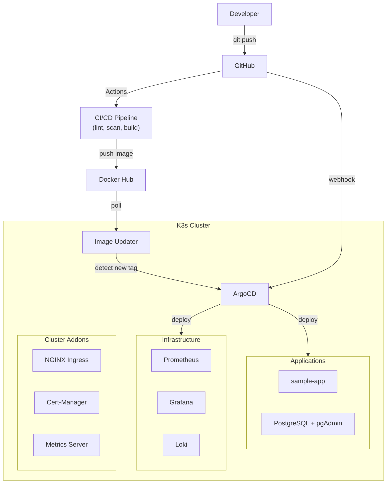

# K3s Dev Platform Lab — Portfolio

> Plataforma cloud-native completa que demuestra practicas reales de DevOps, GitOps, CI/CD, observabilidad y seguridad sobre Kubernetes.

---

## Que es este proyecto?

Un laboratorio de infraestructura funcional construido desde cero sobre **K3s** (Kubernetes ligero), diseñado para simular un entorno de produccion real. Incluye despliegue automatizado, monitoreo, logging, escaneo de seguridad y rollback automatico.

No es un tutorial. Es un entorno que funciona, se despliega y se gestiona como infraestructura real.

---

## Stack completo

| Capa | Tecnologia | Funcion |
|------|-----------|---------|
| Orquestacion | K3s (Kubernetes) | Cluster ligero de produccion |
| GitOps | ArgoCD + Image Updater | Despliegue automatico desde Git |
| CI/CD | GitHub Actions | Build, test, scan, deploy |
| Monitoring | Prometheus | Recoleccion de metricas |
| Dashboards | Grafana | Visualizacion de metricas y logs |
| Logging | Loki + Promtail | Agregacion centralizada de logs |
| Base de datos | PostgreSQL 16 | StatefulSet con persistencia |
| DB Admin | pgAdmin 4 | Gestion visual de PostgreSQL |
| Ingress | NGINX Ingress Controller | Enrutamiento de trafico (NodePort 31080/31443) |
| TLS | Cert-Manager | Certificados automaticos |
| Seguridad | Trivy | Escaneo de vulnerabilidades (imagen + manifiestos) |
| Calidad | SonarQube (LTS Community) | Analisis estatico de codigo (con PostgreSQL dedicado) |
| Linting | KubeLinter + yamllint | Validacion de manifiestos K8s y sintaxis YAML |

---

## Capacidades demostradas

### GitOps con ArgoCD

ArgoCD sincroniza automaticamente el estado del cluster con el repositorio. Cualquier cambio en `apps/` o `infrastructure/` se detecta y despliega sin intervencion manual.

<!-- screenshot: argocd-dashboard.png -->

**Funcionalidades:**
- Sync automatico con self-heal (si alguien modifica algo en el cluster, ArgoCD lo revierte)
- Prune automatico (si se elimina un recurso del repo, se elimina del cluster)
- Image Updater integrado (detecta nuevas imagenes en Docker Hub y actualiza el deployment)
- Multiples aplicaciones gestionadas: sample-app, postgres, infrastructure

### CI/CD Pipeline completo

El pipeline se activa automaticamente al hacer push y ejecuta multiples etapas:

<!-- screenshot: github-actions-overview.png -->

```
push a main
    |
    v
+-------------------+     +------------------+     +------------------+
| Lint Manifests    |     | Trivy Security   |     | SonarQube        |
| (KubeLinter +     |     | (Image scan +    |     | (Code quality    |
|  yamllint)        |     |  Config scan)    |     |  analysis)       |
+-------------------+     +------------------+     +------------------+
    |
    v
+-------------------+
| Build & Push      |
| (Docker Hub)      |
+-------------------+
    |
    v
+-------------------+
| ArgoCD Image      |
| Updater detects   |
| new tag & deploys |
+-------------------+
    |
    v
+-------------------+
| Health Check      |---> OK: done
| (post-deploy)     |---> FAIL: auto rollback
+-------------------+
```

**Workflows:**

| Workflow | Que hace | Trigger |
|----------|---------|---------|
| Build & Push | Construye imagen Docker y sube a Docker Hub | Push a `apps/sample-app/docker/` |
| Lint Manifests | Valida YAML con KubeLinter y yamllint | Push/PR que modifica YAML |
| Trivy Scan | Escanea vulnerabilidades en imagen y manifiestos | Push/PR que modifica Dockerfiles |
| SonarQube | Analisis estatico de calidad de codigo | Push/PR a main |
| Auto Rollback | Health check post-deploy, rollback si falla | Despues del build o manual |

Todos los workflows generan **GitHub Job Summaries** visuales con tablas, conteo de issues y secciones colapsables.

<!-- screenshot: github-summary-trivy.png -->

### Observabilidad

Stack completo de monitoreo y logging integrado al cluster:

<!-- screenshot: grafana-dashboard.png -->

**Prometheus** recolecta metricas de todos los pods y servicios del cluster. **Grafana** las visualiza en dashboards pre-configurados. **Loki** agrega los logs de todos los contenedores para busqueda centralizada.

| Servicio | Puerto local | Credenciales |
|----------|-------------|-------------|
| ArgoCD | :8080 (HTTPS) | admin / (auto) |
| Grafana | :3000 | admin / admin |
| Prometheus | :9090 | - |
| SonarQube | :9001 | admin / admin |
| pgAdmin | :5050 | admin@devlab.com / admin123 |
| PostgreSQL | :5432 | admin / admin123 |
| Sample App | :8081 | - |
| Loki | :3100 | - |

<!-- screenshot: prometheus-targets.png -->

### Base de datos con persistencia

PostgreSQL 16 desplegado como **StatefulSet** con PersistentVolumeClaim, demostrando manejo de estado en Kubernetes. pgAdmin 4 incluido para gestion visual.

<!-- screenshot: pgadmin-dashboard.png -->

**Caracteristicas:**
- StatefulSet (no Deployment) — patron correcto para bases de datos
- PVC de 1Gi con ReadWriteOnce
- Readiness probe con `pg_isready`
- Secrets para credenciales (no hardcodeados en el deployment)
- pgAdmin pre-configurado para administracion visual

### Seguridad y calidad de codigo

**Trivy** escanea en dos niveles:
- **Imagen Docker** — detecta CVEs en dependencias y el OS base
- **Manifiestos Kubernetes** — detecta misconfiguraciones (containers como root, sin limits, etc.)

<!-- screenshot: trivy-scan-results.png -->

**SonarQube** (LTS Community) desplegado dentro del cluster con su propia base de datos PostgreSQL. Analiza calidad de codigo, detecta bugs, code smells y vulnerabilidades. Accesible en http://localhost:9001.

<!-- screenshot: sonarqube-dashboard.png -->

### Rollback automatico

Si un deploy deja una app en estado unhealthy, el workflow de rollback:

1. Consulta el estado de la app via ArgoCD CLI
2. Si no esta Healthy + Synced, obtiene la revision anterior
3. Ejecuta `argocd app rollback` automaticamente
4. Genera un summary con los detalles del rollback

<!-- screenshot: rollback-summary.png -->

Se puede ejecutar manualmente desde GitHub Actions seleccionando la app a rollbackear.

### Automatizacion con scripts

Todo el entorno se levanta con 2 comandos:

```bash
bash scripts/bootstrap.sh    # K3s + addons + ArgoCD
bash scripts/deploy-infra.sh  # Prometheus + Grafana + Loki + apps
```

| Script | Funcion |
|--------|---------|
| `bootstrap.sh` | Instala K3s, configura kubeconfig, despliega addons y ArgoCD |
| `deploy-infra.sh` | Despliega monitoring, logging y registra apps en ArgoCD |
| `port-forward-all.sh` | Expone todos los servicios localmente con un solo comando |
| `cleanup.sh` | Desinstala K3s y limpia todo el entorno |

---

## Arquitectura



Para ver los diagramas detallados: [docs/architecture.md](architecture.md)

---

## Estructura del repositorio

```
k3s-platform/
├── .github/workflows/       # CI/CD pipelines
│   ├── build-sample-app.yaml
│   ├── lint-manifests.yaml
│   ├── trivy-scan.yaml
│   ├── sonarqube.yaml
│   └── rollback.yaml
├── apps/                    # Aplicaciones
│   ├── sample-app/          # App de ejemplo con Dockerfile
│   └── postgres/            # PostgreSQL + pgAdmin
├── argocd-apps/             # Definiciones GitOps
│   ├── sample-app.yaml
│   ├── postgres.yaml
│   └── infrastructure.yaml
├── cluster/                 # Bootstrap y addons
│   ├── bootstrap/
│   └── addons/
├── infrastructure/          # Servicios de plataforma
│   ├── argocd/
│   ├── argocd-image-updater/
│   ├── monitoring/
│   ├── logging/
│   └── sonarqube/
├── scripts/                 # Automatizacion
├── docs/                    # Documentacion
└── sonar-project.properties
```

---

## Screenshots

> Las siguientes capturas seran agregadas proximamente.

| Captura | Descripcion |
|---------|-------------|
| <!-- argocd-dashboard.png --> | Dashboard de ArgoCD con las apps desplegadas |
| <!-- github-actions-overview.png --> | Vista general de GitHub Actions con los workflows |
| <!-- github-summary-trivy.png --> | Job Summary de Trivy con resultados del escaneo |
| <!-- grafana-dashboard.png --> | Dashboard de Grafana con metricas del cluster |
| <!-- prometheus-targets.png --> | Targets de Prometheus mostrando los endpoints |
| <!-- pgadmin-dashboard.png --> | pgAdmin conectado a PostgreSQL |
| <!-- sonarqube-dashboard.png --> | Dashboard de SonarQube con analisis del proyecto |
| <!-- trivy-scan-results.png --> | Resultados detallados del escaneo de Trivy |
| <!-- rollback-summary.png --> | Job Summary del rollback automatico |

---

## Tecnologias y herramientas


